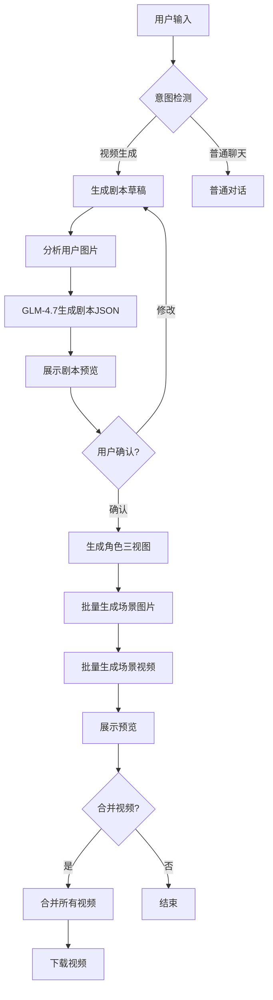
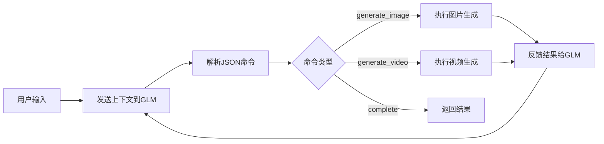

# AI漫导项目迁移计划 (Android → Web)

> **目标**: 将Flutter安卓应用完整迁移到Node.js + React Web平台
> **文档日期**: 2026-02-03
> **预计工期**: 4-6周

---

## 📋 项目概述

### 原始项目
- **平台**: Android (Flutter)
- **功能**: AI驱动的动漫风格视频创作工具
- **核心能力**: 文本→剧本→图片→视频 的完整工作流

### 目标平台
- **后端**: Node.js + Express + TypeScript
- **前端**: React + Next.js + TypeScript
- **数据库**: SQLite (开发) / PostgreSQL (生产)
- **缓存**: Redis
- **队列**: Bull (Redis-based)

---

## 🎯 核心功能清单

### 必须实现的功能 ✅

#### 1. 聊天系统
- [ ] 用户消息输入和发送
- [ ] 图片上传预览 (最多3张)
- [ ] 消息列表展示 (用户/AI消息区分)
- [ ] Markdown渲染支持
- [ ] 图片/视频消息预览
- [ ] 实时流式响应 (SSE/WebSocket)

#### 2. AI视频生成流程
- [ ] **意图检测**: 识别视频生成请求
- [ ] **剧本生成**: 调用GLM-4.7生成结构化剧本
- [ ] **角色分析**: 分析用户上传图片提取角色特征
- [ ] **角色三视图**: 生成正面/侧面/背面组合图保持人物一致性
- [ ] **剧本预览**: 展示剧本草稿供用户确认
- [ ] **场景图片生成**: 批量生成所有场景图片 (并发控制)
- [ ] **场景视频生成**: 批量生成所有场景视频 (异步轮询)
- [ ] **进度追踪**: 实时显示生成进度
- [ ] **媒体预览**: 全屏查看图片和视频
- [ ] **视频合并**: 合并所有场景视频为完整视频
- [ ] **下载导出**: 下载生成的视频文件

#### 3. 设置管理
- [ ] API密钥配置 (智谱GLM/视频API/图像API/豆包)
- [ ] 缓存管理 (查看/清理)
- [ ] 数据库信息展示
- [ ] 视频合并测试功能

#### 4. 会话管理
- [ ] 多会话支持
- [ ] 会话列表侧边栏
- [ ] 创建/切换/删除会话
- [ ] 会话历史持久化

---

## 🏗️ 技术架构迁移

### 架构对比

| 层级 | Flutter实现 | Web实现 |
|------|-------------|---------|
| **UI层** | Flutter Widgets | React + Next.js + shadcn/ui |
| **状态管理** | Provider | Zustand + Immer |
| **数据获取** | Dio | Axios + TanStack Query |
| **持久化** | Hive | SQLite + Prisma |
| **缓存** | flutter_cache_manager | Redis |
| **任务队列** | Dart Stream | Bull + Redis |
| **视频处理** | Android MediaMuxer | FFmpeg (fluent-ffmpeg) |

### 目录结构映射

```
Flutter项目                          Web项目 (Next.js)
─────────────────────────────────    ─────────────────────────────────
lib/screens/                         app/
  ├── chat_screen.dart      →         ├── chat/page.tsx
  ├── settings_screen.dart  →         ├── settings/page.tsx
  ├── screenplay_review_screen.dart → ├── screenplay-review/page.tsx
  └── ...                              └── ...

lib/providers/                       stores/
  ├── chat_provider.dart    →         ├── chatStore.ts
  ├── conversation_provider.dart →    ├── conversationStore.ts
  └── ...                              └── ...

lib/controllers/                     controllers/
  ├── agent_controller.dart →         ├── agentController.ts
  ├── screenplay_controller.dart →    ├── screenplayController.ts
  └── ...                              └── ...

lib/services/                        services/
  ├── api_service.dart      →         ├── apiService.ts
  ├── api_config_service.dart →       ├── apiConfigService.ts
  └── ...                              └── ...

lib/models/                          models/
  └── *.dart                →         └── *.ts

lib/widgets/                         components/
  └── *.dart                →         └── *.tsx
```

---

## 🔄 核心业务流程

### 流程1: 视频生成完整流程



### 流程2: ReAct智能体循环



---

## 📊 数据库模型

### 核心表结构

```sql
-- 会话表
CREATE TABLE conversations (
  id TEXT PRIMARY KEY,
  title TEXT NOT NULL,
  created_at DATETIME DEFAULT CURRENT_TIMESTAMP,
  updated_at DATETIME DEFAULT CURRENT_TIMESTAMP
);

-- 消息表
CREATE TABLE messages (
  id TEXT PRIMARY KEY,
  conversation_id TEXT,
  role TEXT NOT NULL, -- 'user' | 'assistant' | 'system'
  content TEXT NOT NULL,
  images JSON,
  media_url TEXT,
  media_type TEXT,
  timestamp DATETIME DEFAULT CURRENT_TIMESTAMP,
  FOREIGN KEY (conversation_id) REFERENCES conversations(id)
);

-- 剧本表
CREATE TABLE screenplays (
  id TEXT PRIMARY KEY,
  conversation_id TEXT,
  title TEXT NOT NULL,
  genre TEXT,
  duration TEXT,
  emotional_arc JSON,
  characters JSON,
  scenes JSON,
  status TEXT, -- 'pending' | 'generating_images' | 'generating_videos' | 'completed' | 'error'
  created_at DATETIME DEFAULT CURRENT_TIMESTAMP,
  completed_at DATETIME,
  FOREIGN KEY (conversation_id) REFERENCES conversations(id)
);

-- 配置表
CREATE TABLE api_configs (
  id TEXT PRIMARY KEY,
  key_name TEXT NOT NULL,
  key_value TEXT,
  updated_at DATETIME DEFAULT CURRENT_TIMESTAMP
);
```

---

## 🔌 外部API集成

### API服务清单

| 服务 | 用途 | 端点 | Node.js实现 |
|------|------|------|-------------|
| **智谱GLM-4.7** | 剧本生成、聊天对话 | `https://open.bigmodel.cn/api/paas/v4` | ✅ 需迁移 |
| **苍何视频API** | 视频生成 | `https://api.tu-zi.com` | ✅ 需迁移 |
| **苍何图片API** | 图片生成 | `https://api.tu-zi.com` | ✅ 需迁移 |
| **豆包ARK** | 图片理解 | `https://ark.cn-beijing.volces.com/api/v3` | ✅ 需迁移 |

---

## ⚙️ 关键技术点

### 1. 并发控制
- **图片生成**: 默认同时处理2个场景
- **视频生成**: 默认同时处理2个场景
- **实现方案**: 使用 `p-limit` 或 `async-pool`

### 2. 异步任务轮询
- **视频生成状态**: 提交任务后轮询查询状态
- **超时设置**: 10分钟
- **轮询间隔**: 2秒

### 3. 流式响应
- **方案**: Server-Sent Events (SSE)
- **用途**: 实时显示AI生成进度
- **替代**: WebSocket (复杂场景)

### 4. 视频合并
- **方案**: FFmpeg (fluent-ffmpeg)
- **方式**: 无损合并 (concat demuxer)
- **输出**: MP4格式

### 5. 角色一致性
- **技术**: 角色三视图 (正面+侧面+背面)
- **应用**: 图生图时作为参考图
- **目的**: 确保各场景人物外观一致

---

## 🎨 UI设计规范

### 颜色系统
```
主色:      #8B5CF6 (创意紫)
次色:      #EC4899 (动漫粉)
强调色:    #F59E0B (活力金)
背景色:    #F8F7FC (浅紫灰)
文字色:    #1A1A2E (深紫黑)
```

### 组件风格
- **卡片**: 玻璃态效果 (backdrop-blur)
- **按钮**: 渐变背景 + 阴影
- **消息**: 用户(紫渐变) / AI(玻璃态)
- **输入**: 圆角 + 阴影

### 响应式断点
```
移动端:  < 768px
平板:    768px - 1024px
桌面:    > 1024px
```

---

## 📁 项目文件结构

```
director-ai-web/
├── app/                           # Next.js App Router
│   ├── layout.tsx                # 根布局
│   ├── page.tsx                  # 首页
│   ├── globals.css               # 全局样式
│   ├── chat/
│   │   └── page.tsx              # 聊天页面
│   ├── settings/
│   │   └── page.tsx              # 设置页面
│   ├── screenplay-review/
│   │   └── page.tsx              # 剧本确认页面
│   ├── scene-media/
│   │   └── page.tsx              # 媒体查看页面
│   └── api/                      # API路由
│       ├── chat/
│       ├── screenplay/
│       ├── image/
│       ├── video/
│       └── config/
│
├── components/                    # UI组件
│   ├── ui/                       # shadcn组件
│   ├── chat/                     # 聊天相关
│   ├── settings/                 # 设置相关
│   ├── screenplay/               # 剧本相关
│   └── shared/                   # 通用组件
│       ├── GlassCard.tsx
│       ├── GradientButton.tsx
│       ├── ProgressTracker.tsx
│       └── LoadingShimmer.tsx
│
├── stores/                        # Zustand状态管理
│   ├── chatStore.ts
│   ├── conversationStore.ts
│   ├── screenplayStore.ts
│   ├── videoMergeStore.ts
│   └── apiConfigStore.ts
│
├── controllers/                   # 业务逻辑控制器
│   ├── agentController.ts
│   ├── screenplayController.ts
│   ├── screenplayDraftController.ts
│   └── videoMergeController.ts
│
├── services/                      # API服务
│   ├── apiService.ts             # 核心API封装
│   ├── apiConfigService.ts       # 配置管理
│   ├── screenplayParser.ts       # 剧本解析
│   ├── imageGenerationService.ts # 图片生成
│   └── videoGenerationService.ts # 视频生成
│
├── models/                        # 类型定义
│   ├── index.ts
│   ├── chat.ts
│   ├── screenplay.ts
│   ├── character.ts
│   └── scene.ts
│
├── utils/                         # 工具函数
│   ├── logger.ts
│   ├── promptSanitizer.ts
│   ├── apiErrorHandler.ts
│   └── rateLimiter.ts
│
├── hooks/                         # 自定义Hooks
│   ├── useScrollToBottom.ts
│   ├── useVideoPlayer.ts
│   └── useMediaQuery.ts
│
├── lib/                           # 工具库
│   ├── utils.ts
│   ├── prisma.ts                 # Prisma客户端
│   └── redis.ts                  # Redis连接
│
├── prisma/
│   └── schema.prisma             # 数据库模型
│
├── types/                         # 全局类型
│   └── index.ts
│
├── public/                        # 静态资源
├── tests/                         # 测试文件
├── .env                           # 环境变量
├── next.config.js
├── tailwind.config.ts
└── package.json
```

---

## 🚀 部署方案

### 开发环境
```bash
# 本地开发
npm run dev

# 数据库迁移
npx prisma migrate dev
```

### 生产环境
```bash
# 构建
npm run build

# 启动
npm start
```

### Docker部署
```dockerfile
# 多阶段构建
FROM node:18-alpine AS builder
WORKDIR /app
COPY package*.json ./
RUN npm ci
COPY . .
RUN npm run build

FROM node:18-alpine
WORKDIR /app
COPY --from=builder /app/dist ./dist
COPY --from=builder /app/node_modules ./node_modules
COPY package.json .
EXPOSE 3000
CMD ["npm", "start"]
```

---

## 📋 验收标准

### 功能验收
- [ ] 用户可以输入文字生成视频
- [ ] 用户可以上传图片作为角色参考
- [ ] 系统生成剧本供用户确认
- [ ] 系统批量生成场景图片
- [ ] 系统批量生成场景视频
- [ ] 用户可以预览所有生成的媒体
- [ ] 用户可以合并并下载完整视频
- [ ] 用户可以配置API密钥
- [ ] 用户可以管理多个会话

### 性能验收
- [ ] 剧本生成 < 10秒
- [ ] 图片生成并发控制正常
- [ ] 视频生成轮询机制正常
- [ ] 页面加载 < 3秒
- [ ] 流式响应无延迟

### 兼容性验收
- [ ] Chrome 90+
- [ ] Firefox 88+
- [ ] Safari 14+
- [ ] Edge 90+
- [ ] 移动端浏览器

---

## 📝 注意事项

1. **API密钥安全**: 前端不存储敏感API密钥，通过后端代理调用
2. **错误处理**: 每个API调用都要有重试机制和降级方案
3. **资源清理**: 定期清理临时文件和过期缓存
4. **并发限制**: 严格控制并发数，避免API限流
5. **提示词净化**: 过滤敏感词，避免生成违规内容
6. **视频格式**: 统一使用MP4格式，确保兼容性

---

*文档版本: 1.0.0*
*创建日期: 2026-02-03*
